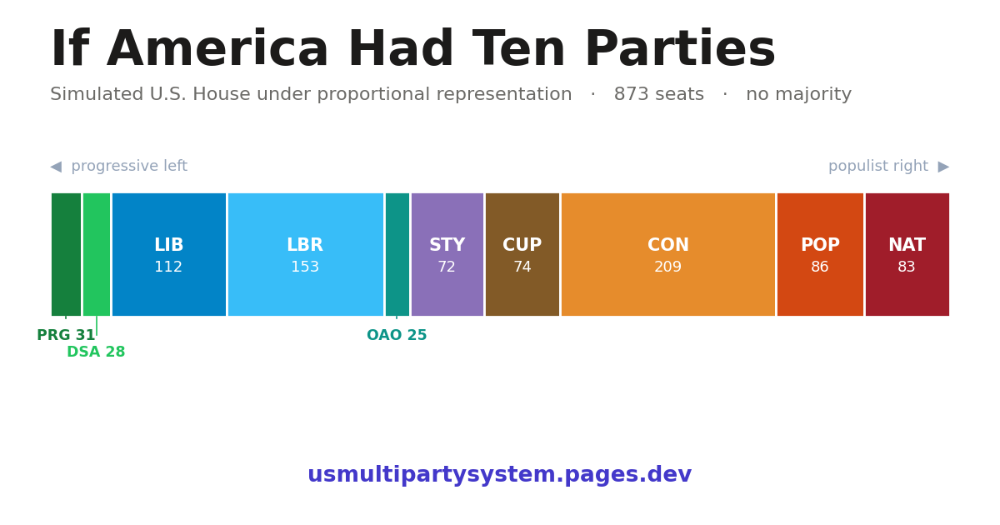

# American Multi-Party Electoral Simulation

A full-stack simulation of what American politics might look like under proportional representation, using real ideological data from the **2024 Cooperative Election Study (CES)**: 60,000+ respondents, 45,707 after listwise deletion.



> **▶ Explore the live simulation: <https://usmultipartysystem.pages.dev/>**
>
> **Methodology:** [`docs/METHODOLOGY.md`](docs/METHODOLOGY.md) — how 45,707 survey responses become a nine-party legislature, with caveats.
> For the full technical reference (agent/developer guide), see [`docs/AGENTS.md`](docs/AGENTS.md); for EFA factor loadings, [`docs/EFA_FACTORS.md`](docs/EFA_FACTORS.md).

## Overview

This project explores what American politics might look like under different electoral rules:
- **Multi-party proportional representation** instead of winner-take-all
- **Single Transferable Vote (STV)** primaries with Droop quota surplus transfers
- **A rolling presidential primary** with geographic balance across 4 rounds
- **Ranked Pairs Condorcet and IRV** for senate general elections (reported side by side)
- **Two candidate fields** — party-line vs. crossover — run through every chamber and the presidency
---

## Pipeline at a Glance

```
2024 CES Survey (N=45,707)
        │
        ▼
  Exploratory Factor Analysis (EFA)
  24 policy items → 5 latent ideological dimensions (F1–F5)
        │
        ▼
  DPGMM Clustering
  Factor scores → 10 voter typology clusters (C0–C9)
        │
        ▼
  Two candidate fields (used for House, Senate, and President)
  • Party-line  (pure_multi):       3 identical-platform candidates per party
  • Crossover   (factor_deviation): candidates shifted ±1 axis off base
        │
        ├──────────────────────────────────────┐
        ▼                                      ▼
  House STV Simulation                   Senate Simulation
  873 seats / 180 districts              51 senators (one per state)
  Droop quota + Gregory surplus          STV primary → Condorcet + IRV
  → pure_multi/ + factor_deviation/      4 scenarios (2 fields × 2 methods)
        │                                      │
        └──────────────┬───────────────────────┘
                       ▼
             Chamber Vote Model
             37 binary policy items
             Sum-of-Binomials → P(pass)
```

---

## The 10-Party Typology

Produced by **Dirichlet Process Gaussian Mixture Model (DPGMM)** clustering on 5 EFA factor scores. C7 is **permanently dissolved** — never competes for seats; their ballots transfer to next-ranked active party.

| ID | Abbrev | Name | Character | ~Electorate |
|----|--------|------|-----------|-------------|
| C0 | CON | Conservative | Mainstream center-right; pro-law enforcement, economically traditional | ~19% |
| C1 | SD | Social Democrat | Center-left institutionalist; supports safety net, moderate on social issues | ~16% |
| C2 | STY | Solidarity | Disaffected working-class left; skeptical of institutions, economically left but low union density | ~15% |
| C3 | NAT | Nationalist | Populist right; strong on immigration, anti-establishment, very high F5 | ~9% |
| C4 | LIB | Liberal | College-educated progressive; socially liberal, moderate-left economics | ~9% |
| C5 | POP | Populist | Right-of-center reformists; skeptical of elections, high F2 + F5 | ~11% |
| C6 | CUP | Civic Union Party | True centrists; cross-pressured, low electoral skepticism | ~10% |
| C7 | — | Blue Dogs *(dissolved)* | Conservative Democrats; pre-eliminated in all simulations, 0 seats | — |
| C8 | DSA | DSA | Progressive left; far left on security, high electoral skepticism | ~6% |
| C9 | PRG | Progressive | Progressive elite; urban, far left across most dimensions | ~5% |

**House seat counts (party-line, canonical):** CON=202, SD=164, STY=130, POP=99, CUP=103, LIB=93, DSA=22, NAT=46, PRG=14, C7=0 (dissolved). Conservative is the largest party. Source: `viz/src/data/houseSeats.json` — see **[docs/DATA_SOURCES.md](docs/DATA_SOURCES.md)**. *(Do not quote `clusterProfiles.json` `seatsHouse` for seat counts — it's a population baseline, not seats won.)*

---

## The 5 Ideological Factors (EFA)

Factor scores are standardized to the survey population (mean≈0, SD≈1). Absolute tier thresholds reflect position relative to the full electorate:

| Tier | Score Range |
|------|-------------|
| Very High | > +0.75 |
| High | +0.25 to +0.75 |
| Medium | −0.25 to +0.25 |
| Low | −0.75 to −0.25 |
| Very Low | < −0.75 |

### F1 — Security & Order
**High** = pro-law enforcement, pro-border security, pro-surveillance
**Low** = civil libertarian, anti-enforcement
*Top items: support increased police (+0.73), increase border patrols (+0.71), deny asylum (+0.66), oppose decreasing police (+0.65)*

### F2 — Electoral Skepticism
**High** = believes elections are NOT run fairly; distrusts voting systems
**Low** = trusts electoral institutions
*Top items: state/local elections not fair (+0.90), US elections not fair (+0.73)*
Note: Near-orthogonal to partisan ID — STY, POP, and DSA all score High despite being ideologically distant on F1/F5.

### F3 — Government Distrust
**High** = low trust in federal and state government
**Low** = trusts government institutions
*Top items: distrust federal govt (+0.66), distrust state govt (+0.48)*
**Key finding: All 23 winning coalition types score Medium on F3 (range −0.21 to +0.13) — this axis does not differentiate winning coalitions at all.**

### F4 — Religious Traditionalism
**High** = traditional religious values; conservative on abortion and same-sex marriage
**Low** = secular, socially progressive
*Top items: church attendance (+0.69), abortion week limits (+0.69), oppose same-sex marriage recognition (+0.65)*

### F5 — Populist Conservatism
**High** = populist-right; anti-immigration, fiscal conservatism, racial traditionalism
**Low** = progressive-left
*Top items (negative-loaded): racial resentment (−0.62), oppose police reform (−0.56), oppose Dreamers (−0.54), oppose tax hike on $400k+ (−0.53)*
NAT is the extreme high end (+1.51); PRG (−0.99) and LIB (−0.95) are the extreme low end.

---

## House STV Simulation

**Scripts:** `pipeline/stv_main.py` and supporting `pipeline/stv_step1.py`–`pipeline/stv_step5.py`
**Published result:** `data/outputs/pure_multi/house/stv_seat_summary.csv` → `viz/src/data/houseSeats.json` (the party-line view the viz shows).
**Note:** published seat counts come from `pure_multi`, *not* from `data/outputs/No_C7_canonical/stv_seat_summary.csv` (an outdated 750-seat summary — don't quote it). The `No_C7_*` directories are retained on purpose: the pure_multi and factor_deviation runs read their `ballots_checkpoint.parquet` + `district_apportionment.csv`, and the viz transfer matrix is built from `No_C7_canonical/transfer_matrix_10party.csv`. See [docs/DATA_SOURCES.md](docs/DATA_SOURCES.md).

- **873 seats** across **180 multi-member districts** (Urban / Suburban / Rural tiers per state)
- Apportionment: Hamilton method, ~380,000 pop/seat from 2020 Census
- **Droop quota:** `⌊ total_weight / (seats + 1) ⌋ + 1`
- **Gregory surplus transfer:** fractional weight redistribution when a candidate exceeds quota
- **C7 pre-dissolved:** their voters' ballots skip to next-ranked active party before Round 1
- Ballots derived from DPGMM soft cluster probabilities via Plackett-Luce ranking

**Seat results (party-line, canonical):**

| Party | Seats | % | Urban | Suburban | Rural |
|-------|-------|---|-------|----------|-------|
| CON | 202 | 23.1% | 106 | 68 | 28 |
| SD | 164 | 18.8% | 96 | 51 | 17 |
| STY | 130 | 14.9% | 71 | 50 | 9 |
| CUP | 103 | 11.8% | 59 | 30 | 14 |
| POP | 99 | 11.3% | 47 | 38 | 14 |
| LIB | 93 | 10.7% | 62 | 26 | 5 |
| NAT | 46 | 5.3% | 16 | 18 | 12 |
| DSA | 22 | 2.5% | 14 | 6 | 2 |
| PRG | 14 | 1.6% | 10 | 3 | 1 |

This is the **party-line** field. The **crossover** field (`run_fd_house_stv.py` → `data/outputs/factor_deviation/house/`) runs the same STV over axis-shifted candidates; the viz House tab toggles between the two fields and the double/triple Wyoming-rule apportionments.

---

## Senate Simulation

**Scripts:** crossover field — `pipeline/run_fd_senate_simulation.py`; party-line field — `pipeline/pure_only/run_pure_multi_senate.py` (each runs both Condorcet and IRV)
**Outputs:** `data/outputs/factor_deviation/senate/` and `data/outputs/pure_multi/senate/` — `senate_composition.csv` (Condorcet) and `senate_irv_composition.csv` (IRV)

- **51 senators** — one per state (50 states + DC).
- The senate uses the same **two candidate fields** as the rest of the simulation (there are no "blend" candidates):
  - **Party-line (`pure_multi`)** — 3 candidates per party, all on the identical party platform (e.g. `STY_1`). Tests proportional voting with parties as monoliths.
  - **Crossover (`factor_deviation`)** — 9 pure party candidates + 28 *crossover* candidates that shift one party off its base on a single axis: Security & Order, Anti-Establishment, or Populist Conservatism (±). Variant codes like `STY_lo_ae` (Solidarity, less anti-establishment).
- In each state, an **STV primary** narrows the field; the **general** is then decided two ways — **Ranked Pairs Condorcet** (beats-all winner) and **IRV** (last-place elimination).
- Two fields × two methods = **4 scenarios.**

**Senate seats by party across the four scenarios:**

| Party | Crossover Cond | Crossover IRV | Party-line Cond | Party-line IRV |
|-------|:--:|:--:|:--:|:--:|
| STY | 34 | 19 | 33 | 11 |
| SD  | 11 | 27 | 15 | 26 |
| CON | 1  | 3  | 1  | 11 |
| POP | 5  | 1  | 1  | 2  |
| CUP | 0  | 1  | 1  | 0  |
| LIB | 0  | 0  | 0  | 1  |

NAT, DSA, and PRG win 0 senate seats in every scenario. **Pattern:** Condorcet rewards broad acceptability, so Solidarity (the spatial median) dominates; IRV rewards first-choice intensity, so Social Democrat leads and Conservative breaks through in the party-line field. Full state-by-state results are in [`comms/party_profiles.md`](comms/party_profiles.md).

---

## Chamber Vote Model

**Script:** `pipeline/chamber_vote_model.py`
**Outputs:** `data/outputs/senate/senate_vote_model.csv`, `data/outputs/house_vote_model.csv`

For each of **37 binary CC24\_ policy items**, models the probability of a bill passing a floor vote.

**Method — Sum-of-Independent-Binomials → Normal approximation:**
```
E[Y]    = Σᵢ nᵢ · pᵢ                               (expected yes votes)
σ²[Y]   = Σᵢ nᵢ · pᵢ · (1 − pᵢ)
P(pass) = 1 − Φ((majority − 0.5 − E[Y]) / σ[Y])    (continuity correction)
```
where `nᵢ` = seats held by type `i`, `pᵢ` = that type's % supporting / 100.

**Verdict thresholds:** PASS ≥67% | TOSS-UP 33–67% | FAIL ≤33%
**Results (both chambers):** 29 PASS / 1 TOSS-UP / 7 FAIL

These chambers are cross-cutting — they simultaneously pass both tax cuts AND tax hikes, both border enforcement AND Dreamer protections. Different majority coalitions form for each vote. This is expected behavior for proportional multi-party representation.

---

## Coalition Analysis

**Script:** `pipeline/cross_chamber_coalitions.py`
**Output:** `data/outputs/coalitions/` (feeds the viz House tab's coalition view)

A secondary diagnostic — *not* the election model (the chambers are elected via the party-line and crossover fields above). For each of the 5 factor dimensions it shows which house and senate party types fall on the same side, surfacing issue-specific coalition partners rather than overall ideological proximity. Per factor it computes `k=2` poles (1D k-means) and absolute EFA-scale tiers.

| Output File | Contents |
|-------------|----------|
| `coalition_type_profiles.csv` | per-type F1–F5 scores, chamber tag, seat counts |
| `coalition_factor_alignment.csv` | per-(factor × type) rank, k=2 pole, absolute tier |
| `coalition_pairwise.csv` | per-factor pairwise alignment scores (0–1) |

---

## Output Files Reference

All outputs are under `data/outputs/`.

| File | Description |
|------|-------------|
| `pure_multi/house/stv_seat_summary.csv` | **Party-line House** seat totals by party + density tier (→ `houseSeats.json`) |
| `factor_deviation/house/stv_seat_summary.csv` | **Crossover House** seat totals (→ `fdHouseSeats.json`) |
| `pure_multi/senate/senate_composition.csv` · `senate_irv_composition.csv` | **Party-line Senate** — Condorcet / IRV winner per state |
| `factor_deviation/senate/senate_composition.csv` · `senate_irv_composition.csv` | **Crossover Senate** — Condorcet / IRV winner per state |
| `No_C7_canonical/{ballots_checkpoint.parquet, district_apportionment.csv}` | Shared ballot + apportionment cache the pure_multi / factor_deviation runs read as input — see [DATA_SOURCES.md](docs/DATA_SOURCES.md) |
| `No_C7_canonical/transfer_matrix_10party.csv` | Vote-transfer matrix (→ viz `transferMatrix.json`) |
| `profiles/cluster_stats.csv` | Per-item statistics for all 10 clusters (policy + demographics) |
| `senate/senate_chamber_profile.csv` · `house_chamber_profile.csv` | Seat-weighted policy aggregates per chamber (vote-model inputs) |
| `senate/senate_vote_model.csv` · `house_vote_model.csv` | 37-item bill passage probability per chamber |
| `coalitions/coalition_type_profiles.csv` (+ `_factor_alignment`, `_pairwise`) | Secondary cross-chamber factor-alignment diagnostic |

---

## Running the Pipeline

All scripts live in `pipeline/` and use relative paths anchored to the project root.

All 10 clusters are active parties (C7 = **Order and Opportunity Party**). The election
sims + `prepare_data.py` are the reproducible path; they read `data/processed/*.csv` and
the geography checkpoint in `data/outputs/No_C7_canonical/` (party-independent).

```bash
# ── Base geography checkpoint (already cached; rebuilds ballots + apportionment) ──
python3 pipeline/stv_main.py

# ── Party-line field (pure_multi): ballots, primary, president, house, senate ──
python3 pipeline/pure_only/generate_pure_multi_ballots.py
python3 pipeline/pure_only/generate_party_ballots.py       # single-candidate ballots (transfers)
python3 pipeline/pure_only/run_pure_multi_primary.py
python3 pipeline/pure_only/run_pure_multi_presidential.py
python3 pipeline/pure_only/run_pure_multi_house_stv.py             # → pure_multi/house/
python3 pipeline/pure_only/run_pure_multi_house_stv.py --triple    # → pure_multi_triple/house/
python3 pipeline/pure_only/run_pure_multi_senate.py               # → pure_multi/senate/ (Condorcet + IRV)

# ── Crossover field (factor_deviation) ──────────────────────────────────────
python3 pipeline/generate_factor_deviation_candidates.py   # OAO fields base only (small party)
python3 pipeline/generate_factor_deviation_ballots.py
python3 pipeline/generate_factor_deviation_stats.py        # per-candidate policy support
python3 pipeline/run_fd_house_stv.py                       # → factor_deviation/house/
python3 pipeline/run_fd_house_stv.py --triple
python3 pipeline/run_fd_senate_simulation.py               # → factor_deviation/senate/ (Condorcet + IRV)
python3 pipeline/run_fd_primary_2028.py
python3 pipeline/run_fd_irv_2028.py                        # FD presidential

# ── Canonical house + shared profiles ───────────────────────────────────────
python3 pipeline/run_house_canonical.py            # → No_C7_canonical/ (party-card seats)
python3 pipeline/house_chamber_profile.py          # House chamber policy aggregate
python3 pipeline/generate_blend_stats.py           # blended-type policy support (senate analysis)

# ── Respondent-level extras (read the raw .dta directly) ────────────────────
python3 pipeline/add_compare_items.py              # FP/abortion/voting items → cluster_stats.csv
python3 pipeline/compute_cohesion.py               # per-cluster cohesion → viz/src/data/clusterCohesion.json

# ── Visualization ──────────────────────────────────────────────────────────
cd viz && python3 scripts/prepare_data.py          # Regenerate all JSON from outputs
npm run dev                                        # Dev server
npm run build                                      # Production build → dist/
```

> **Legacy senate vote-model chain** (`senate_chamber_profile.py` → `chamber_vote_model.py`
> → `generate_results.py`, plus `cross_chamber_coalitions.py`) produces analysis CSVs and
> depends on the archived single-candidate `pure_only/senate/` run. It is **not required**
> for the viz: `prepare_data.py` recomputes every Legislation column (Party-Line, Crossover,
> Triple — House and Senate) directly from the native seat counts × per-cluster policy
> support, so those numbers reflect the current 10-party chambers without the old chain.

### Data provenance / regeneration notes

`stv_main.py` and `generate_blend_stats.py` were archived in an earlier cleanup and have
been restored to `pipeline/` and re-keyed to the current party codes. The only piece still
archive-only is the single-candidate `pure_only/senate/` run, which feeds the **legacy**
senate vote-model chain (see the note above) and is superseded by `prepare_data.py`'s
recompute. Older archived copies under `data/outputs/archive/` and `pipeline/archive/`
predate three party renames (Reform→Populist, Center→Civic Union, SD→Labor, C7→OAO) and
should not be restored as-is.

---

## Dependencies

```
python3 >= 3.10
numpy
pandas
scipy
scikit-learn
pyreadstat      # Stata .dta reading
pyarrow         # Parquet I/O for ballot checkpoint
plotly          # HTML cluster profile visualizations
openpyxl        # Excel read for county density-tier map
```

---

## Data Sources

| Dataset | Description | Path |
|---------|-------------|------|
| 2024 CES | ~60,000 respondents, 2024 Cooperative Election Study | `data/raw/2024 CES Base/CCES24_Common_OUTPUT_vv_topost_final.dta` |
| Typology | DPGMM cluster assignments (45,707 rows) | `data/processed/typology_cluster_assignments.csv` |
| EFA scores | 5 factor scores per respondent | `data/processed/efa_factor_scores.csv` |
| Polychoric matrix | 24×24 polychoric correlation matrix | `data/processed/polychoric_matrix.csv` |

**Analysis sample:** N=45,707 after listwise deletion (24 items + `commonpostweight` non-missing).
